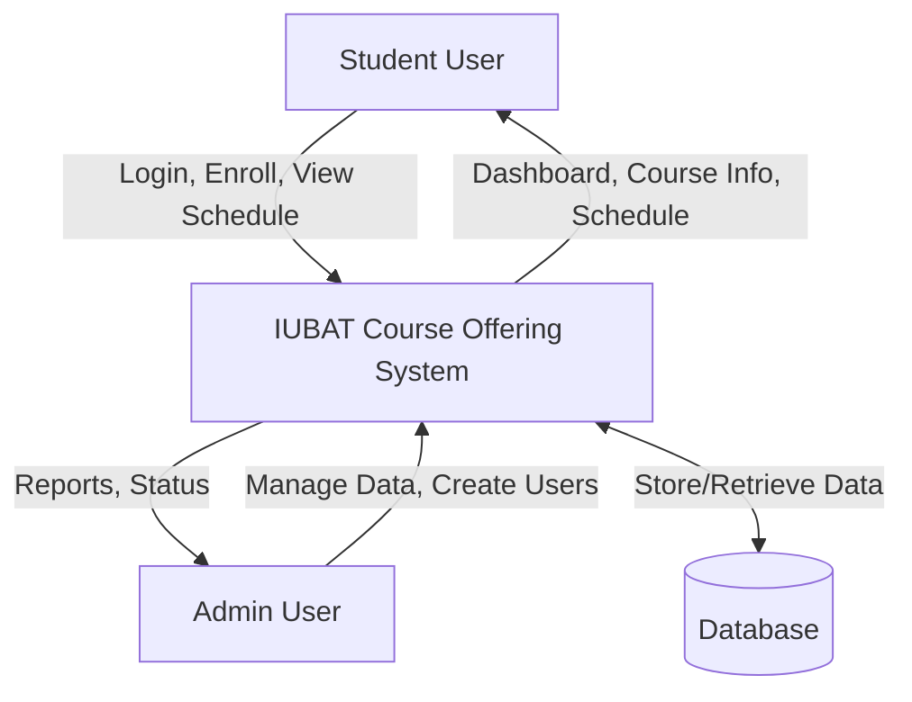
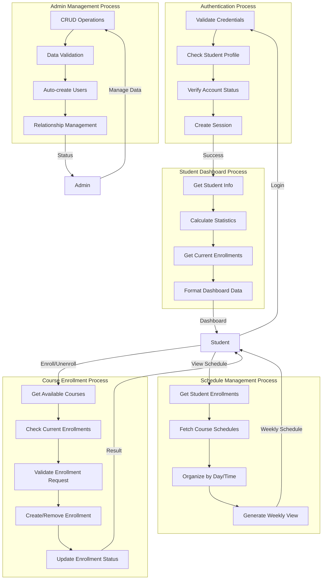

# Data Flow Diagram (DFD)

## Level 0: Context Diagram

## Level 1: System Overview

```mermaid
graph TD
    subgraph "External Entities"
        Student[Student]
        Admin[Admin]
    end
    
    subgraph "IUBAT Course Offering System"
        Auth[Authentication Process]
        StudentMgmt[Student Management]
        CourseMgmt[Course Management]
        EnrollMgmt[Enrollment Management]
        ScheduleMgmt[Schedule Management]
    end
    
    subgraph "Data Stores"
        UserDB[(User Data)]
        StudentDB[(Student Data)]
        CourseDB[(Course Data)]
        ScheduleDB[(Schedule Data)]
        EnrollDB[(Enrollment Data)]
        DeptDB[(Department Data)]
        SemDB[(Semester Data)]
    end
    
    %% Student flows
    Student -->|Login Credentials| Auth
    Auth -->|Authentication Result| Student
    Auth <-->|Validate User| UserDB
    Auth <-->|Get Student Profile| StudentDB
    
    Student -->|View Dashboard Request| StudentMgmt
    StudentMgmt -->|Dashboard Data| Student
    StudentMgmt <-->|Student Statistics| EnrollDB
    
    Student -->|Enrollment Request| EnrollMgmt
    EnrollMgmt -->|Enrollment Status| Student
    EnrollMgmt <-->|Enrollment Records| EnrollDB
    EnrollMgmt <-->|Course Info| CourseDB
    
    Student -->|Schedule Request| ScheduleMgmt
    ScheduleMgmt -->|Weekly Schedule| Student
    ScheduleMgmt <-->|Schedule Data| ScheduleDB
    ScheduleMgmt <-->|Enrollment Data| EnrollDB
    
    %% Admin flows
    Admin -->|Manage Students| StudentMgmt
    StudentMgmt <-->|Student Records| StudentDB
    StudentMgmt <-->|User Accounts| UserDB
    StudentMgmt <-->|Department Info| DeptDB
    
    Admin -->|Manage Courses| CourseMgmt
    CourseMgmt <-->|Course Records| CourseDB
    CourseMgmt <-->|Department Info| DeptDB
    
    Admin -->|Manage Schedules| ScheduleMgmt
    ScheduleMgmt <-->|Schedule Records| ScheduleDB
    ScheduleMgmt <-->|Course Info| CourseDB
    
    Admin -->|Manage Enrollments| EnrollMgmt
    EnrollMgmt <-->|Student Info| StudentDB
    EnrollMgmt <-->|Semester Info| SemDB
```

## Level 2: Detailed Process Flow

## Data Flow Summary

### Student Processes:
1. **Authentication**: Login validation and session management
2. **Dashboard**: View enrollment statistics and current semester info
3. **Course Enrollment**: Enroll/unenroll from available courses
4. **Schedule Viewing**: Display weekly class routine
5. **AJAX Operations**: Quick enrollment actions

### Admin Processes:
1. **Department Management**: CRUD operations on departments
2. **Course Management**: Manage courses and their details
3. **Schedule Management**: Set up course schedules and sections
4. **Student Management**: Create students and auto-generate user accounts
5. **Enrollment Management**: Oversee student enrollments
6. **Semester Management**: Manage academic semesters

### Key Data Flows:
- **User Authentication** → Student Profile → Dashboard Statistics
- **Course Selection** → Enrollment Validation → Database Update
- **Student Enrollments** → Course Schedules → Weekly Routine
- **Admin Operations** → Data Validation → Database CRUD → Status Response