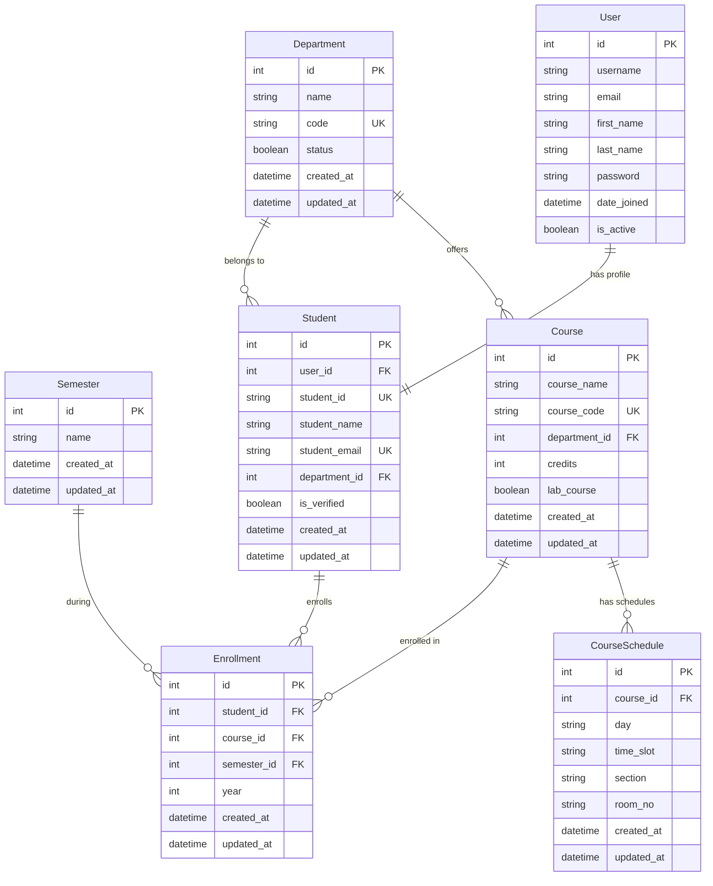

# Entity Relationship Diagram (ERD)

## Key Relationships:

1. **User ↔ Student**: One-to-One relationship (Student profile extends Django User)
2. **Department ↔ Course**: One-to-Many (Department offers multiple courses)
3. **Department ↔ Student**: One-to-Many (Students belong to departments)
4. **Course ↔ CourseSchedule**: One-to-Many (Course can have multiple schedules/sections)
5. **Course ↔ Enrollment**: One-to-Many (Course can have multiple enrollments)
6. **Student ↔ Enrollment**: One-to-Many (Student can enroll in multiple courses)
7. **Semester ↔ Enrollment**: One-to-Many (Multiple enrollments per semester)

## Unique Constraints:
- Department: `code`
- Course: `course_code`
- Student: `student_id`, `student_email`
- CourseSchedule: `(course, day, time_slot, section)`
- Enrollment: `(student, course, semester, year)`